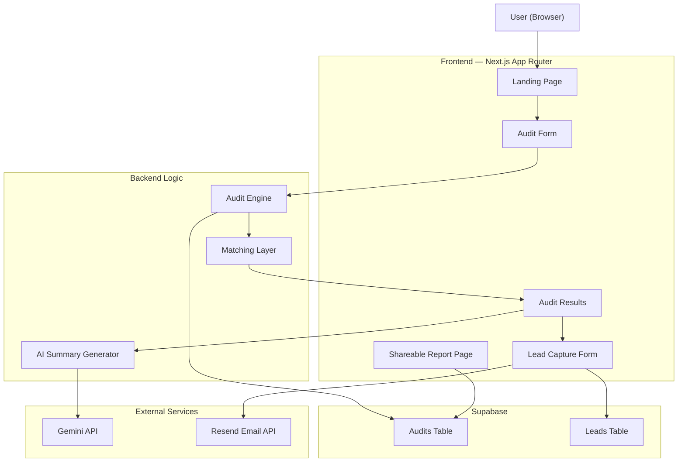

> **Project:** PromptLedger — AI Spend Audit Tool  
> **Stack:** Next.js 16 · TypeScript · Tailwind CSS · Supabase · Resend · Gemini API · Vitest  
> **Status:** MVP

---

# 1. Project Overview

PromptLedger is a web application that helps startups and small teams analyze their AI tooling costs and identify opportunities to reduce unnecessary spending.

The platform allows users to:
- input their current AI stack,
- specify plans, monthly spend, seats, and use cases,
- generate an instant audit,
- receive optimization recommendations,
- estimate monthly and annual savings,
- and access a shareable public report.

The core idea behind the product is:
> Most startups adopt AI tools very quickly but rarely optimize their spending structure afterward.

Many companies end up:
- paying for higher-tier plans unnecessarily,
- duplicating tool capabilities,
- overusing enterprise subscriptions,
- or using expensive APIs for workloads cheaper models can handle.

PromptLedger identifies these inefficiencies using rule-based financial logic instead of purely AI-generated recommendations.

The product is intentionally designed as:
- a useful standalone startup utility,
- and a lead-generation engine for Credex.

---

# 2. System Architecture Diagram

---

# 3. Data Flow

## Step 1 — User Input

The user fills the audit form with:
- AI tool name
- selected plan
- monthly spend
- number of seats
- primary use case
- team size

Form state is persisted locally so refreshes do not erase progress.

---

## Step 2 — Audit Engine Processing

The frontend sends structured data to the audit engine.

The engine:
- resolves the current plan,
- validates use case compatibility,
- evaluates capability levels,
- compares pricing,
- and calculates optimization opportunities.

The logic is entirely deterministic and rule-based.

AI is not used for financial calculations because:
- predictable logic is more reliable,
- recommendations need to be financially defensible,
- and pricing comparisons should remain transparent.

---

## Step 3 — Recommendation Matching

The matching layer searches:
- same-vendor cheaper plans,
- alternative vendor tools,
- and compatible lower-cost API models.

Recommendations are filtered using:
- capability level,
- use case compatibility,
- team size constraints,
- and pricing thresholds.

The recommendation hierarchy is:

1. Same-vendor downgrade
2. Alternative vendor recommendation
3. Keep current plan

This prioritization reduces migration friction for users.

---

## Step 4 — Savings Calculation

The audit engine calculates:
- optimized monthly spend
- monthly savings
- annual savings

Results are aggregated into:
- per-tool breakdowns
- total savings summaries
- and optimization explanations.

---

## Step 5 — AI Summary Generation

After the structured audit is generated, the recommendation data is passed to Gemini API.

Gemini generates:
- a founder-friendly summary,
- simplified explanations,
- and actionable observations.

If the API fails:
- the system falls back to static summary templates.

This prevents audit failure because of AI downtime.

---

## Step 6 — Persistence and Sharing

Audit results are stored in Supabase with unique IDs.

Each audit receives:
- a public shareable URL,
- Open Graph metadata,
- and Twitter preview support.

Sensitive fields like:
- company name
- and email

are excluded from public reports.

---

## Step 7 — Lead Capture

Users can optionally submit:
- email
- company name
- role
- team size

The backend stores leads in Supabase and triggers transactional emails through Resend.

High-savings users are surfaced as stronger Credex leads.

---

# 4. Audit Engine Design

The audit engine is the core of PromptLedger.

It uses structured registries for:
- subscription plans
- and API pricing models.

The project separates:
- SaaS subscriptions
- and API-based pricing

because both behave differently economically.

---

## Subscription Plans

Stored inside:
- `aiPlans`

Each plan includes:
- tool
- plan
- capability level
- use cases
- team size constraints
- monthly pricing

---

## API Plans

Stored inside:
- `api_direct`

Each API model includes:
- token pricing
- use cases
- capability levels
- enterprise readiness

---

## Capability Level System

Each plan receives a capability score from:
- 1 → basic
- 4 → frontier-grade

This prevents:
- unrealistic downgrades,
- or recommending weak models for complex workloads.

Example:
- a Level 4 coding workflow should never downgrade into a Level 1 autocomplete model only because it is cheaper.

This was one of the most important architectural constraints in the system.

---

# 5. Why I Chose This Stack

## Next.js 16

I chose Next.js because:
- App Router provides clean routing,
- deployment on Vercel is simple,
- server/client separation is straightforward,
- and SSR support helps for shareable pages and SEO.

The framework also made Open Graph integration easier.

---

## TypeScript

TypeScript was used to:
- improve reliability,
- catch runtime issues early,
- and enforce structured audit logic.

During development, TypeScript helped detect:
- undefined values,
- invalid pricing access,
- and inconsistent recommendation structures.

---

## Tailwind CSS

Tailwind allowed:
- fast UI iteration,
- responsive layouts,
- and consistent styling

without building a custom CSS system.

---

## Supabase

Supabase was selected because:
- setup is fast,
- PostgreSQL support is reliable,
- and integration with Next.js is simple.

It was sufficient for:
- audit storage,
- lead capture,
- and public report retrieval.

---

## Gemini API

Gemini was used only for:
- summary generation.

I intentionally avoided using AI for audit logic because:
- deterministic financial rules are easier to validate,
- cheaper to compute,
- and safer for recommendation systems.

---

## Resend

Resend simplified:
- transactional email delivery,
- audit confirmation emails,
- and shareable report workflows.

---

## Vitest

Vitest was used for:
- audit engine testing,
- savings calculation validation,
- and recommendation logic testing.

Testing business logic separately from UI reduced debugging complexity.

---

# 6. Scaling Considerations

If PromptLedger needed to support:
- 10,000+ audits/day

I would improve the architecture in several areas.

---

## Queue-Based AI Processing

Currently:
- AI summaries generate synchronously.

At scale:
- summaries should move into background jobs.

Possible solutions:
- BullMQ
- Inngest
- Trigger.dev

---

## Pricing Registry Database

Currently:
- pricing data is hardcoded.

At scale:
- pricing should move into a managed database table,
- with automated update pipelines.

---

## Redis Rate Limiting

Basic protection currently exists.

At scale:
- Redis-backed distributed rate limiting would be required.

---

## Analytics Layer

I would add:
- PostHog
- or Mixpanel

to track:
- audit completion rates,
- conversion funnels,
- recommendation acceptance,
- and lead quality.

---

## Caching

Frequently shared reports should use:
- edge caching,
- ISR,
- or CDN caching

to reduce database load.

---

# 7. Engineering Tradeoffs

## Rule-Based Recommendations vs AI Recommendations

I intentionally chose:
- deterministic recommendation logic

instead of:
- fully AI-generated recommendations.

Reason:
- pricing recommendations need consistency and explainability.

---

## No Authentication

The MVP does not require login.

This improves:
- onboarding speed,
- shareability,
- and conversion rate.

Tradeoff:
- limited personalization.

---

## Static Pricing Registry

Pricing data is currently manually maintained.

This simplified:
- development speed
- and debugging.

Tradeoff:
- pricing updates require manual maintenance.

---

## Public Shareable Reports

Reports are intentionally public by UUID.

This improves:
- virality,
- screenshots,
- and sharing.

Tradeoff:
- reports must avoid sensitive company data.

---

# 8. Security and Abuse Protection

The application includes:
- environment variable protection,
- server-side recommendation logic,
- and basic abuse protection.

Important measures:
- no secrets stored in repo,
- public reports stripped of personal data,
- frontend cannot access recommendation internals directly.

Basic abuse protection can be expanded later using:
- hCaptcha
- Redis rate limiting
- IP throttling

---

# 9. Future Improvements

If I continued this project beyond the assignment, I would build:

- benchmark mode
- team-wide AI analytics
- PDF report export
- automated pricing sync
- AI stack monitoring over time
- organization dashboards
- API spend estimators
- onboarding simplification for non-technical founders

I would also improve:
- mobile UX,
- report visualizations,
- and onboarding clarity.

Long-term, PromptLedger could evolve into:
> an operating system for startup AI spending decisions.