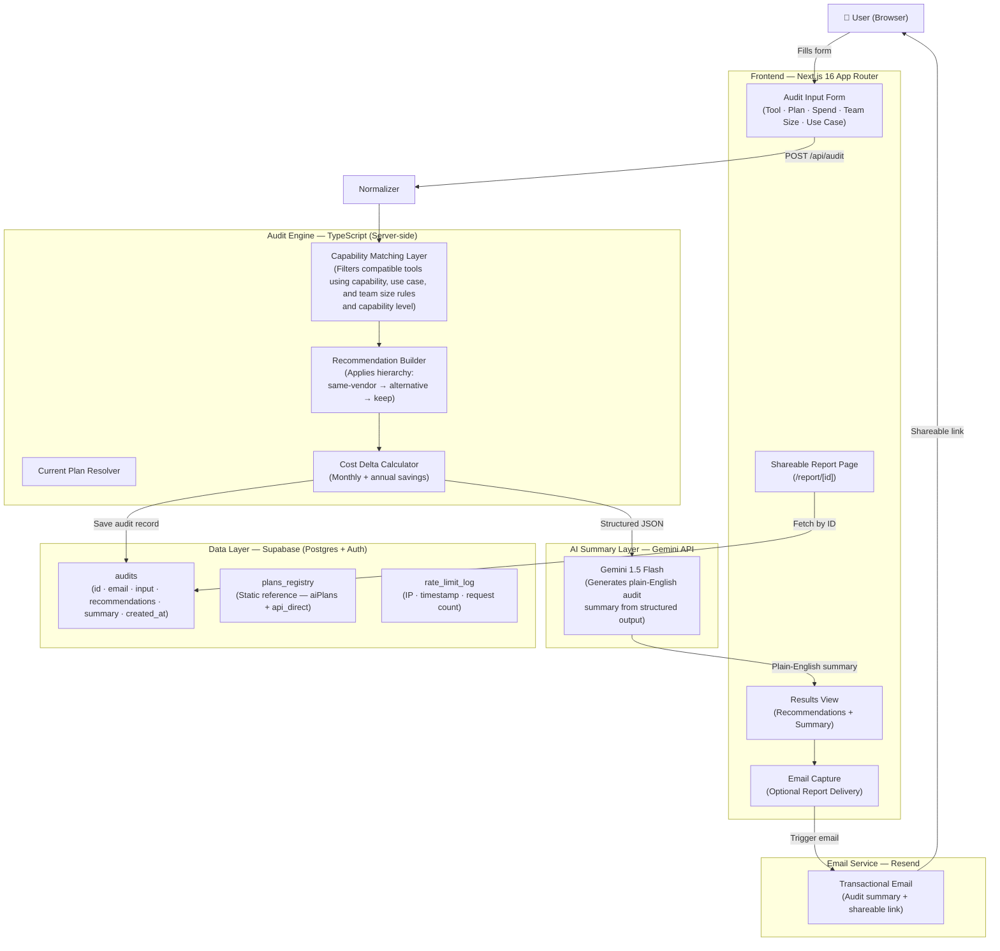

# ARCHITECTURE.md — PromptLedger

> **Project:** PromptLedger — AI Spend Audit Tool  
> **Stack:** Next.js 16 · TypeScript · Tailwind CSS · Supabase · Resend · Gemini API  
> **Status:** MVP

---

## Table of Contents

1. [Project Overview](#1-project-overview)
2. [System Architecture Diagram](#2-system-architecture-diagram)
3. [Data Flow](#3-data-flow)
4. [Audit Engine Design](#4-audit-engine-design)
5. [Why This Stack](#5-why-this-stack)
6. [Scaling Considerations](#6-scaling-considerations)
7. [Engineering Tradeoffs](#7-engineering-tradeoffs)
8. [Security and Abuse Protection](#8-security-and-abuse-protection)
9. [Future Improvements](#9-future-improvements)

---

## 1. Project Overview

PromptLedger is a web tool that takes a startup or engineering team's current AI tooling spend — product subscriptions, API usage, team size, and use case — and produces a defensible audit report that identifies overspending, recommends cheaper alternatives or plan downgrades, and surfaces enterprise/credit opportunities that small teams routinely miss.

The core insight this tool is built around: most teams are on misaligned pricing tiers for their actual operational needs. Many startups pay for collaborative or enterprise-oriented plans despite having small teams, while others use higher-capability models for workloads that could be handled by substantially cheaper alternatives with similar practical utility. The audit engine is designed specifically to identify those mismatches using capability-aware recommendation logic instead of generic price comparison.

This document covers the architecture decisions, engine design, and operational considerations for the MVP. It is not a product spec — it is a record of how the system is actually built and why.

---

## 2. System Architecture Diagram



The architecture deliberately keeps the audit engine server-side. The recommendation logic is not exposed to the client — only the final result is returned. This prevents scraping of the tool registry and keeps the API surface small.

---

## 3. Data Flow

This is what happens from form submission to delivered report.

**Step 1 — Form Submission**  
The user fills in one or more AI tools they use: tool name, plan name, monthly spend in USD, team size (headcount), and primary use case selected from a fixed enum (e.g., `coding`, `writing`, `data`, `research`, `mixed`).

The form submits a `POST` request to `/api/audit` with a typed `AuditRequest` payload.

**Step 2 — Current Plan Resolution**  
The audit engine resolves the submitted tool and plan against the internal registries (`aiPlans` and `api_direct`). If a matching entry exists, the corresponding structured plan object is used for capability and pricing evaluation.

The current implementation assumes valid tool and plan input from the frontend form and focuses primarily on recommendation logic rather than complex normalization or fuzzy matching. Unknown tools are currently skipped by the audit engine instead of being force-matched to an alternative.

**Step 3 — Capability Matching**  
For each recognized tool, the matching layer retrieves all plans across same-vendor and alternative vendors that satisfy the submitted use case. Candidates are filtered by:

- `useCases` — the plan must cover the submitted use case
- `capabilityLevel` — the plan must be ≥ the minimum level required to handle the workload (see §4)
- `teamSizeCompatibility` — the plan must be compatible with the submitted team size
- `registry separation` — subscription-based products are stored in `aiPlans`, while API-based products are stored in `api_direct`. The audit engine evaluates these registries independently instead of mixing both operational categories together. against API products

This produces a scored candidate list for each submitted tool.

**Step 4 — Recommendation Building**  
The engine computes savings and generates a recommendation reason explaining the optimization path..
The full candidate list is not returned to the client. Only the top recommendation per tool is surfaced.

**Step 5 — AI Summary Generation**  
The structured recommendation output (tool names, current spend, recommended spend, savings, recommendation types) is passed as a prompt payload to the Gemini 1.5 Flash API. The prompt instructs the model to produce a 150–250 word plain-English audit summary written for a non-technical founder or engineering lead. The model is not asked to invent recommendations — it is summarizing the engine's output.

If summary generation fails, the structured audit result can still be returned independently of the AI-generated summary.

**Step 6 — Persistence**  
The complete audit — input, recommendations, cost deltas, and AI summary — is written to the `audits` table in Supabase. A UUID is generated for the record. This UUID is used to construct the shareable report URL: `/report/[id]`.

**Step 7 — Email Capture and Delivery**  
Before the full results are revealed in the UI, the user is prompted to enter their email address. On submission, Resend fires a transactional email containing the audit summary and a link to the shareable report page. The shareable page is publicly accessible by UUID — no authentication required to view a shared report.

---

## 4. Audit Engine Design

### 4.1 Plan Registry Structure

All known AI products are stored in two registries:

**`aiPlans`** — subscription-based products (e.g., ChatGPT Plus, Claude Pro, GitHub Copilot Business). Each entry carries:

```typescript
type UseCase =
  | "coding"
  | "writing"
  | "research"
  | "data"
  | "mixed"

type aiPlans = {
  tool: string
  plan: string
  useCases: UseCase[]
  capabilityLevel: number
  minTeamSize: number
  maxTeamSize: number
  monthlyPrice: number | null
}
```

**`api_direct`** — API-accessed products billed by token/request (e.g., OpenAI API, Anthropic API, Gemini API). Each entry carries:

```typescript
type api_direct = {
  tool: string
  plan: string
  useCases: UseCase[]
  capabilityLevel: number
  inputPricePerMTok: number 
  outputPricePerMTok: number 
  enterpriseReady: boolean
}
```

Keeping these two registries separate is a deliberate choice. A team paying $20/month for ChatGPT Plus is buying a product experience with rate limiting, plugin access, and DALL·E integration. A team using the OpenAI API is buying compute. These are not interchangeable in a recommendation without user context the form does not capture, so the engine does not attempt cross-type comparisons.

### 4.2 Capability Level Hierarchy

Each plan is assigned a capability level from 1 to 4:

| Level | Description | Example |
|-------|-------------|---------|
| 1 | Basic — simple Q&A, short-form content, autocomplete | GPT-3.5, Gemini Flash |
| 2 | Intermediate — multi-step reasoning, moderate context | Claude Haiku, GPT-4o Mini |
| 3 | Advanced — complex reasoning, long context, code | GPT-4o, Claude Sonnet |
| 4 | Frontier — research-grade, deep analysis, multimodal | Claude Opus, GPT-4 with tools |

The hierarchy is transitive: a Level 4 plan can handle Level 3, 2, and 1 workloads. A Level 3 plan handles Level 2 and 1. A team submitting a use case that requires Level 2 capability will only be recommended Level 2+ plans — the engine will never recommend a downgrade that drops below the minimum capability required for their stated workload.

This is the most important constraint in the engine. Without it, the cheapest option would always win, and the recommendations would be operationally irresponsible.

### 4.3 Recommendation Priority Hierarchy

For each submitted tool, the engine evaluates candidates in this order:

**Priority 1 — Same-Vendor Cheaper Plan**  
Check if the same vendor offers a lower-tier plan that still meets the capability and use case requirements. This is surfaced first because it carries zero migration risk. The team is already authenticated, integrated, and familiar with the vendor's API or UI. A plan downgrade requires a single billing change.

Example: A team of 3 paying for ChatGPT Team ($30/user/month) for basic content drafting, when ChatGPT Plus ($20/month) covers their capability requirement individually.

**Priority 2 — Alternative Vendor**  
If no same-vendor downgrade exists (the team is already on the cheapest qualifying plan), look for a cheaper plan from a different vendor that meets the same capability and use case criteria. This recommendation is flagged as `alternative` and the output notes that migration is required.

Example: A team using Claude Pro for code generation, when GitHub Copilot Business covers the same use case at a lower blended cost per developer.

**Priority 3 — Keep Current**  
If the current plan is already the cheapest qualifying option across all vendors, the engine returns a `keep` recommendation. The audit still notes the current monthly spend and confirms the team is not overpaying for this tool.

### 4.4 Why Same-Vendor Comes First

This ordering is an explicit product decision, not a technical constraint.

Cross-vendor alternatives are objectively harder to act on. They require re-integration, re-evaluation of data handling agreements (important for teams processing customer data through AI APIs), potential retraining for non-technical users, and a budget approval cycle. For a startup, the switching cost is real.

A same-vendor downgrade, by contrast, is actionable in minutes. Prioritizing it means the audit produces recommendations that teams will actually implement, which makes PromptLedger useful rather than theoretically correct.

---